  

  

  <h4><i>"Security-first mindset. System-level curiosity. Built by code, broken by instinct."</i></h4>

> **STATUS:** Building systems. Questioning assumptions. Learning continuously.

## 👨‍💻 About Me

*I’m a Computer Science student focused on security-first software engineering, studying how systems behave, break, and scale under real-world conditions.*

### 🔐 Focus & Interests

I'm building a well-rounded foundation in computer science, bridging the gap between how software is built and how it can be secured. While cybersecurity is my primary lens, I love exploring all facets of technology.

**Areas of Intent:**
- ⚙️ **Understanding OS + network-level behavior**
- 🌐 **Building scalable full-stack apps**
- 🛡️ **Breaking and defending web systems** (OWASP mindset)
- 🔍 **Reverse engineering how systems fail**

### 🧠 Philosophy

- Understand systems before trusting them
- Complexity hides vulnerabilities
- Security is not an add-on — it is architecture

### ⚡ Current Direction

Right now, I’m focused on strengthening my core computer science knowledge to become a versatile tech professional:

- 🧠 **Security-Oriented Thinking** applied to modern tech development
- 🏗️ **Software Engineering** and clean coding practices
- 💻 **Operating System Internals** and resource management
- 🌍 **Networking Models** and data communication

## 🛠️ Technology & Tools Arsenal

### 🛡️ Security & Exploitation
 
 
 

### 💻 Programming Languages
 
 
 

### 🌐 Web & Full-Stack

 

### 🖥️ OS, Systems & Networks
 
 
 
 

## 📈 GitHub Stats & Activity

  
  

  

  

## 📫 Let's Connect

  
  
  
  

 

> **Think like a system. Build like an engineer. Break like an attacker.**
