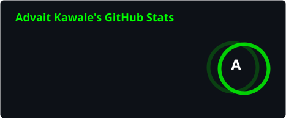
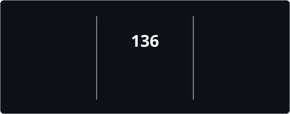
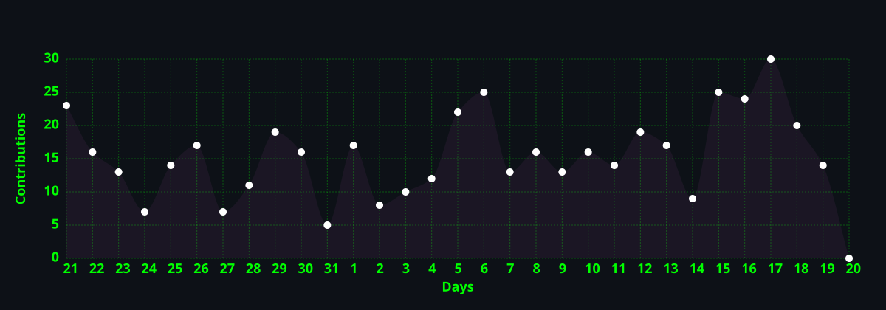
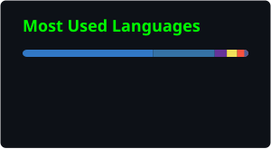

  

  

  <h4><i>"Security-first mindset. System-level curiosity. Built by code, broken by instinct."</i></h4>

> **STATUS:** Building systems. Questioning assumptions. Learning continuously.

## 👨‍💻 About Me

*I’m a Computer Science student focused on security-first software engineering, studying how systems behave, break, and scale under real-world conditions.*

### 🔐 Focus & Interests

I'm building a well-rounded foundation in computer science, bridging the gap between how software is built and how it can be secured. While cybersecurity is my primary lens, I love exploring all facets of technology.

**Areas of Intent:**
- ⚙️ **Understanding OS + network-level behavior**
- 🌐 **Building scalable full-stack apps**
- 🛡️ **Breaking and defending web systems** (OWASP mindset)
- 🔍 **Reverse engineering how systems fail**

### 🧠 Philosophy

- Understand systems before trusting them
- Complexity hides vulnerabilities
- Security is not an add-on — it is architecture

### ⚡ Current Direction

Right now, I’m focused on strengthening my core computer science knowledge to become a versatile tech professional:

- 🧠 **Security-Oriented Thinking** applied to modern tech development
- 🏗️ **Software Engineering** and clean coding practices
- 💻 **Operating System Internals** and resource management
- 🌍 **Networking Models** and data communication

## 🛠️ Technology & Tools Arsenal

<table border="1" width="100%">

  <tr>
    <td colspan="60" align="center"><h3>🛡️ Security & Exploitation</h3></td>
  </tr>
  <tr>
    <td colspan="15" align="center">
       
      Burp Suite
    </td>
    <td colspan="15" align="center">
       
      Metasploit
    </td>
    <td colspan="15" align="center">
       
      Nmap
    </td>
    <td colspan="15" align="center">
       
      OWASP
    </td>
  </tr>

  <tr>
    <td colspan="60" align="center"><h3>💻 Programming Languages</h3></td>
  </tr>
  <tr>
    <td colspan="12" align="center">
       
      Python
    </td>
    <td colspan="12" align="center">
       
      Java
    </td>
    <td colspan="12" align="center">
       
      C
    </td>
    <td colspan="12" align="center">
       
      JavaScript
    </td>
    <td colspan="12" align="center">
       
      Bash
    </td>
  </tr>

  <tr>
    <td colspan="60" align="center"><h3>🌐 Web & Full-Stack</h3></td>
  </tr>
  <tr>
    <td colspan="10" align="center">
       
      TypeScript
    </td>
    <td colspan="10" align="center">
       
      React
    </td>
    <td colspan="10" align="center">
       
      Tailwind CSS
    </td>
    <td colspan="10" align="center">
       
      Node.js
    </td>
    <td colspan="10" align="center">
       
      Express.js
    </td>
    <td colspan="10" align="center">
       
      MongoDB
    </td>
  </tr>

  <tr>
    <td colspan="60" align="center"><h3>🖥️ OS, Systems & Networks</h3></td>
  </tr>
  <tr>
    <td colspan="12" align="center">
       
      Kali Linux
    </td>
    <td colspan="12" align="center">
       
      Ubuntu
    </td>
    <td colspan="12" align="center">
       
      Windows
    </td>
    <td colspan="12" align="center">
       
      Wireshark
    </td>
    <td colspan="12" align="center">
       
      Cisco
    </td>
  </tr>

</table>

## 📈 GitHub Stats & Activity

  <h3>👾 Pac-Man eating my contribution graph</h3>
  <picture>
    <source media="(prefers-color-scheme: dark)" srcset="https://raw.githubusercontent.com/Advait251206/Advait251206/output/pacman-contribution-graph-dark.svg">
    <source media="(prefers-color-scheme: light)" srcset="https://raw.githubusercontent.com/Advait251206/Advait251206/output/pacman-contribution-graph.svg">
    
  </picture>
   
  

  
  

  

  

## 📫 Let's Connect

  
  
  
  

 

> **Think like a system. Build like an engineer. Break like an attacker.**
